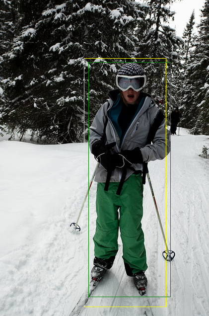

# Deep Learning - Visual Grounding

## Table of Contents
1. [Project Overview](#1-project-overview)
2. [Development Tools](#2-development-tools)
3. [Visual Journey](#3-visual-journey)
4. [Demo](#4-demo)
5. [Bibliography](#5-bibliography)
6. [Authors](#6-authors)

## 1. Project Overview

This project was developed for submission in **Deep Learning** course at **[University of Trento](https://www.unitn.it/en)**.

The main goal was to fine-tune the [Contrastive Language–Image Pre-training](https://openai.com/research/clip) (CLIP) model to predict bounding boxes based on textual descriptions, leveraging advanced techniques and frameworks in deep learning. For this purpose, CLIP was combined with [High-Resolution Network](https://www.microsoft.com/en-us/research/blog/high-resolution-network-a-universal-neural-architecture-for-visual-recognition/) (HRNet). HRNet was chosen due to its versatility in detecting objects of varying sizes by mixing low and high resolution features.

### 1.1 Components of the Solution
- **Dataset**: Utilized the [RefCOCOg](https://huggingface.co/datasets/jxu124/refcocog) dataset for training and evaluation.
- **Feature Extractor**: Employed a combination of fine-tuned CLIP and HRNet for robust feature extraction.
- **Head**: Utilized a Fully-fused Multilayer Perceptron (MLP) for bounding box prediction.
- **Loss Function**: Implemented Huber Loss for smooth L1 loss.
- **Optimizer**: Utilized AdamW, a variant of Adam with weight decay for optimization.
- **Regularization Techniques**: Incorporated Dropout and Batch Normalization to enhance model generalization.
- **Hyperparameter Optimization**: Employed [Optuna](https://optuna.org/) for automated hyperparameter tuning.
- **Evaluation metrics**: Intersection-over-Union/Jaccard-index (IoU) and semantic similarity.

### 1.2 Model Architecture
1. Extract 1024x1x1 image and text features using CLIP.
2. Upsample CLIP resolution to obtain 1024x14x14 image and text feature maps.
3. Reduce the channels to 128x14x14 through 1x1 convolutional operations.
4. Extract 512x14x14 image features using HRNet.
5. Reduce the channel to 64x14x14 through 1x1 convolutional operations.
6. Concatenate the three feature maps (HRNet image features, CLIP image and textual features) and apply additional convolutions to turn the combined feature map to a 256x1x1 vector.
7. Finally, utilize a regression Feed-forward Neural Network (FFN) to predict bounding box coordinates (x, y, w, h) (4x1x1 feature map).

*Specific architecture of HRNet:*
 

### 1.3 Conclusion

The model underwent training for 10 epochs, with parameter tuning and regularization techniques crucial for achieving a 32.8% mIOU test accuracy. Evaluation metrics included semantic similarity calculations using cosine similarity between predicted and ground-truth images.

## 2. Development Tools

- **Platform**: Google Colab
- **Development Environment**: Jupyter Notebook
- **Language**: Python 3.10
- **Libraries**:
    - **[PyTorch](https://pytorch.org/)**: An open-source deep learning framework that facilitates the development and training of neural networks.
    - **[TIMM (PyTorch Image Models)](https://timm.fast.ai/)**: A library providing a collection of pre-trained models for image classification and feature extraction. Used to access HRNet.
    - **[CLIP](https://openai.com/research/clip)**: A powerful model for vision and language tasks, offering joint image-text embeddings.
    - **[Optuna](https://optuna.org/)**: An automated hyperparameter optimization framework, enhancing model performance through systematic parameter tuning.
    - **[Pickle](https://docs.python.org/3/library/pickle.html)**: A Python module for serializing and deserializing Python objects, useful for saving and loading data structures.

## 3. Visual Journey

This section displays the evaluation of the neural network.

*The evolution of model training and validation accuracy over epochs:*

*The evolution of model training and validation loss over epochs:*

*Visual comparisons between predicted and true crop images (based on bounding boxes), highlighting their semantic similarity across the validation set:*

Presented below are comparisons between predicted (yellow) and true (green) bounding boxes generated by the model.

#### Example 1/3:

*Prompt: "a person on skis wearing a beanie , ski goggles , a grey jacket and green pants"*

#### Example 2/3:

*Prompt: "this is the giraffe on the right who is looking towards the camera"*

#### Example 3/3:

*Prompt: "a counter with white paper taped to it"*

## 4. Demo

The project is not uploaded, and access to its contents is provided upon request.

## 5. Bibliography

The following academic papers and portals were used to gather sufficient information and complete the project:

1. Zheng, Z., Wang, P., Liu, W., Li, J., Ye, R., & Ren, D. (2019). Distance-IoU Loss: Faster and Better Learning for Bounding Box Regression. CoRR, abs/1911.08287. [Read the paper](http://arxiv.org/abs/1911.08287).

2. Yu, S., Seo, P. H., & Son, J. (2023). Zero-shot Referring Image Segmentation with Global-Local Context Features. arXiv preprint, arXiv:2303.17811. [Read the paper](http://arxiv.org/abs/2303.17811).

3. Deng, J., Yang, Z., Chen, T., Zhou, W., & Li, H. (2021). TransVG: End-to-End Visual Grounding with Transformers. CoRR, abs/2104.08541. [Read the paper](https://arxiv.org/abs/2104.08541).

4. Yu, L., Lin, Z., Shen, X., Yang, J., Lu, X., Bansal, M., & Berg, T. L. (2018). MAttNet: Modular Attention Network for Referring Expression Comprehension. CoRR, abs/1801.08186. [Read the paper](http://arxiv.org/abs/1801.08186).

5. Li, L. H., Zhang, P., Zhang, H., Yang, J., Li, C., Zhong, Y., Wang, L., Yuan, L., Zhang, L., Hwang, J. N., Chang, K. W., & Gao, J. (2021). Grounded Language-Image Pre-training. CoRR, abs/2112.03857. [Read the paper](https://arxiv.org/abs/2112.03857).

6. Brownlee, J. (2019, December 4). A Gentle Introduction to Batch Normalization for Deep Neural Networks. Deep Learning Performance. [Read the article](https://machinelearningmastery.com/batch-normalization-for-training-of-deep-neural-networks/).

7. Brownlee, J. (2019, August 6). A Gentle Introduction to Dropout for Regularizing Deep Neural Networks. Deep Learning Performance. [Read the article](https://machinelearningmastery.com/dropout-for-regularizing-deep-neural-networks/).

8. High-Resolution Network: A Universal Neural Architecture for Visual Recognition. (2020, June 17). [Read the article](https://www.microsoft.com/en-us/research/blog/high-resolution-network-a-universal-neural-architecture-for-visual-recognition/).

9. Bounding Box Regression Loss. (n.d.). [Read the article](https://hasty.ai/docs/mp-wiki/loss/bounding-box-regression-loss).

## 6. Authors
- Guglielmo Del Col
- Vlad-Lucian Isaia
- Ferenc Szendrei

[Back to Top](#deep-learning---visual-grounding)
